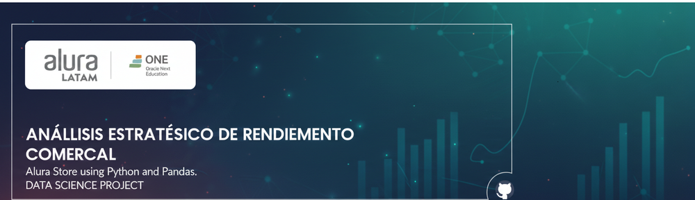

<div align="center">
  <!-- Banner Generado para compatibilidad con GitHub -->
  <a href="https://www.aluracursos.com/" target="_blank">
    
  </a>

  <br><br>

  <a href="https://www.python.org/">
    
  </a>
  
  # 📊 Alura Store: Análisis Estratégico de Ventas
  
  <p align="center">
    <a href="LICENSE">
      
    </a>
    <a href="https://colab.research.google.com/">
      
    </a>
    <a href="https://www.python.org/">
      
    </a>
  </p>
</div>

---


<div align="center">
  <!-- Sube tu imagen a la carpeta assets/images/ y ajusta el nombre aquí -->
  
  <p><em>Visualización de métricas clave del rendimiento de las tiendas.</em></p>
</div>

---

## 📝 Descripción del Proyecto

El **Sr. Juan**, propietario de la cadena de tiendas **Alura Store**, se enfrenta a una decisión estratégica crucial: vender una de sus sucursales para financiar una nueva empresa. 

Este proyecto tiene como objetivo proporcionar una recomendación basada en datos sólidos, analizando el rendimiento histórico de las 4 tiendas en términos de:
*   💰 **Ingresos y Ventas**
*   ⭐ **Satisfacción del Cliente (NPS/Reseñas)**
*   📦 **Eficiencia Logística (Tiempos y Costos de Envío)**

El análisis identifica patrones ocultos y destaca la tienda con el desempeño menos favorable para la venta.

## 🔍 Hallazgos Clave y Conclusiones

Tras un exhaustivo análisis de datos utilizando Python (Pandas, Matplotlib, Seaborn), se han obtenido los siguientes resultados determinantes para la toma de decisiones:

### 📊 Desempeño Comparativo

| Métrica | 🏆 Tienda Líder (Tienda 1) | 📉 Tienda a Vender (Tienda 4) |
| :--- | :--- | :--- |
| **Facturación Total** | **>$1,150 Millones** (Motor financiero) | **Déficit de $112 Millones** vs Líder |
| **Satisfacción (Reseñas)** | 3.97 ⭐ (Área de mejora) | 3.99 ⭐ (Promedio, sin ventaja competitiva) |
| **Transacciones** | Alto volumen en Electrónicos | Baja densidad en categorías clave |

### 💡 Insights Estratégicos

1.  **Ineficiencia Financiera:** La **Tienda 4** presenta el desempeño económico más bajo de la cadena, sin compensarlo con una eficiencia logística superior o una fidelización de clientes destacada.
2.  **Valor Intangible:** La **Tienda 3**, aunque no es la que más factura, posee el mayor capital de reputación con una calificación de **4.05 ⭐**, lo que la hace un activo valioso para la marca a largo plazo.
3.  **Decisión Recomendada:** Se recomienda proceder con la **venta de la Tienda 4**. Esta acción liberará capital con el menor impacto negativo en el flujo de caja global y preservará los puntos de venta más fuertes (Tienda 1) y más queridos (Tienda 3).

---

## 📂 Estructura del Repositorio

El proyecto está organizado de la siguiente manera:

```
├── assets/                     # Recursos estáticos (imágenes)
├── Analysis_Alura_Store.ipynb  # Notebook principal con Análisis y Mapas Interactivos
├── LICENSE                     # Licencia del proyecto (MIT)
└── README.md                   # Documentación oficial
```

---

## 🚀 Cómo Ejecutar este Proyecto

Este análisis está desarrollado en un Jupyter Notebook.

### Opción 1: Google Colab (Recomendado)
1. Descarga el archivo `Analysis_Alura_Store.ipynb` de este repositorio.
2. Sube el archivo a [Google Colab](https://colab.research.google.com/).
3. Ejecuta las celdas para reproducir el análisis y visualizar el **mapa interactivo de tiendas**.

### Opción 2: Localmente
Asegúrate de tener instalado Python y las librerías necesarias:
```bash
pip install pandas matplotlib seaborn folium
```

---

## 📄 Licencia

Este proyecto está bajo la Licencia **MIT**. Consulta el archivo [LICENSE](LICENSE) para más detalles.

---

## ✒️ Autor

**Bernardo Adolfo Gómez Montoya**  
📧 [badolfogm@gmail.com](mailto:badolfogm@gmail.com)

---

<div align="center">
  <p>Desarrollado con 💙 para el Desafío de Data Science de <a href="https://www.aluracursos.com/">Alura Latam</a>.</p>
</div>
